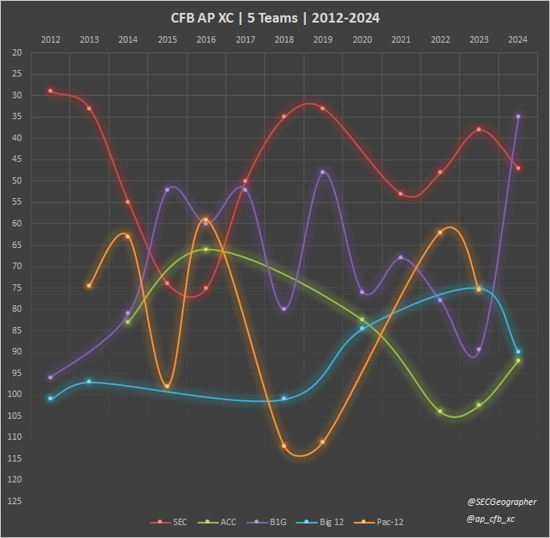

# AP College Football Cross-Country Scoring
***A Data-Driven Approach to Determining Conference Supremacy***


<a href="https://github.com/psf/black"></a>

This repository implements a novel method for evaluating the best college football conferences
using a cross-country scoring mechanism.
This method ranks conferences based on the positions of their top teams in [the Associated Press's Top 25 rankings](https://apnews.com/hub/ap-top-25-college-football-poll)
before, throughout, and at the end of each college football season.
This provides an objective, measurable comparison of conference strength for every week of the season.

## Background

Inspired by the team scoring in cross-country racing,
this method sums the "finishing positions," or the ranking, of the top five teams within each conference.
The conference with the lowest total score is deemed the best,
emphasizing overall depth and strength rather than just top-tier performance
(like whichever conference produced the most recent national champion, or bogus math like detailed in the below tweet).

<blockquote class="twitter-tweet" data-theme="dark"><p lang="en" dir="ltr">Take a look at the average AP Ranking by Power Five Conference 📊<br><br>Which conference surprises you the most? 👀 <a href="https://t.co/qJ0AWkQkOm">pic.twitter.com/qJ0AWkQkOm</a></p>&mdash; FOX College Football (@CFBONFOX) <a href="https://twitter.com/CFBONFOX/status/1615756033103626274?ref_src=twsrc%5Etfw">January 18, 2023</a></blockquote>

This approach was first introduced in 2015 and updated in 2019 and 2024. You can read more about the method and its evolution in the following blog posts:
- [2015: The Race for Supremacy](https://cooperconferencecolumn.wordpress.com/2015/08/25/the-race-for-supremacy-college-football-conferences-evaluated-by-a-cross-country-scoring-system/)
- [2019: AP XC - An Update](https://cooperconferencecolumn.wordpress.com/2019/08/19/ap-xc-an-update/)
- [2024: Updating the race for conference realignments | Medium](https://medium.com/@jacooper1317/the-race-for-college-football-conference-supremacy-a-cross-country-scoring-method-af662221bb88)

The results of this work from 2012-2023:


This code is built upon the ESPN College Football API, shown by [Akshay Easwaran](https://github.com/akeaswaran) to have
[hidden endpoints](https://gist.github.com/akeaswaran/b48b02f1c94f873c6655e7129910fc3b?permalink_comment_id=4376177)
with reliable AP ranking information back to 2014. Thus, this code is dependent upon the quality and stability of ESPN's API data structure.

## Repository Structure

- [`data`](data): Directory containing input data files.
- [`espn_api.py`](espn_api.py): Script for fetching data from the ESPN API.
- [`store_data.py`](store_data.py): Script for storing data fetched from external sources.

## Python Environments
Make sure all [required packages](requirements.in) are installed. You can do this in a few ways:
### 1) Install to Base Interpreter 
Using your command line or bash terminal: 

```bash
pip install -r requirements.in
```

This will install the package's dependencies to your base python interpreter. 
This is not recommended as other python projects or repositories may require different versions of these packages.

### 2) Virtual Environments
Setting up a virtual python environment (venv) is recommended to ensure no dependency conflicts 
across your personal projects or with other developers on this project. 

To create or update your venv, this repository includes a tool to do this on Windows operating systems. 

#### Windows `py_venv` Tool
The [`py_venv`](py_venv) subdirectory includes setup files that can create your venv for you. 

To do this, first open the [`.\py_venv\set_python_path.bat`](py_venv/set_python_path.bat) in a text editor.
Set the `PYTHON_PATH` variable to the base interpreter off of which you want the venv to be built.

* Recommended: use your interpreter that was included in your ArcGIS Pro installation. 
This will ensure you will have all geoprocessing functions accessible in your venv.

Then, execute the following in a **Windows command prompt** with the current directory set to the root of this repo:

```shell
.\py_venv\setup.bat
```

This batch file will install a virtual python environment for you in the [`py_venv` subdirectory](py_venv) 
based on the specifications in the [`.\requirements.in` file](requirements.in). 

The [`.\py_venv\requirements.txt` file](py_venv/requirements.txt) is generated at the time of the venv setup.
It indicates the most recent development environment in which this repository was developed. 
It is a full `pip freeze` of the development environment.
If you have any package dependency issues, you can reference the [`.\py_venv\requirements.txt`](py_venv/requirements.txt)
 file to compare with your current environment. 

Remember to reference the newly created venv as your new python interpreter. 
This will be located at `.\py_venv\venv\Scripts\python.exe`.

To activate the venv directly in the Windows command prompt, enter
```shell
.\py_venv\venv\Scripts\activate
```

Warning: housing venvs in locations with excessively long paths may cause errors in installing or importing packages.
Make sure to `git clone` the repository into a folder without a long file path.

## Usage

To execute a full run that pulls the latest AP rankings from ESPN and scores them as a cross-country meet,
execute and run the [`store_data.py`](store_data.py) file.

### Specialized Uses

1. **Fetch Data**:
   - Use [`espn_api.py`](espn_api.py) to fetch the latest college football data from ESPN.

   - **Critical Functions**:

     - **`full_ap_xc_run(year: int = None, week=None, four_team_score: bool = False) -> dict`**

       **Purpose**: Fetches the full AP cross-country run data for a given year and week, with an option for four-team scoring.

       **Inputs**:
       - `year`: The year for which to fetch data (optional).
       - `week`: The week for which to fetch data (optional).
       - `four_team_score`: Boolean indicating whether to use four-team scoring (default is `False`).

       **Outputs**:
       - A dictionary containing the fetched data, including conference team data and conference scores.

2. **Store Data**:
   - Use [`store_data.py`](store_data.py) to store the fetched data into a suitable format for analysis.

   - **Critical Functions**:

     - **`summarize_data(week, conference_score_tuple: list, n_teams_str: str = pent, existing_summary_df: pd.DataFrame = None)`**

       **Purpose**: Summarizes data for a given week and conference score tuple. It standardizes the week formatting, handles potential errors, and writes the summary data to a file.

       **Inputs**:
       - `week`: The week to summarize.
       - `conference_score_tuple`: List of conference scores.
       - `n_teams_str`: String indicating the number of teams (default is `pent`).
       - `existing_summary_df`: Existing summary DataFrame (optional).

       **Outputs**:
       - The summary data as a DataFrame.

     - **`store_weekly_results(year: int = None, week=None, four_team_score: bool = False)`**

       **Purpose**: Stores weekly results by calling various functions to fetch, prepare, and write data.

       **Inputs**:
       - `year`: The year to store results for (optional).
       - `week`: The week to store results for (optional).
       - `four_team_score`: Boolean indicating whether to use four-team scoring (default is `False`).

       **Outputs**:
       - The results of the storage operation.

     - **`store_all_data_2014_to_present()`**

       **Purpose**: Stores all data from 2014 to the present year by iterating through each year and week, calling `store_weekly_results` for both four-team and five-team scoring.

       **Inputs**: None

       **Outputs**: None

3. **Counterfactual Conference Analysis**:
   - Use [`counterfactual_conferences_2023.py`](counterfactual_conferences_2023.py) to impose the 2024 conference membership schema onto the 2023 season results, previewing how the realigned conferences could perform in 2024.

   - **Critical Functions**:

     - **`realign_teams(df: pd.DataFrame, n_teams_score: int = 5)`**

       **Purpose**: Realigns teams based on the 2024 conference membership schema and recalculates their standings using the 2023 season results. This function previews the future strength of each conference under the upcoming realignments.

       **Inputs**:
       - `df`: DataFrame containing the 2023 season results.
       - `n_teams_score`: The number of top team scores to sum for each conference (default is 5).

       **Outputs**:
       - A DataFrame with teams realigned to their new conferences and the recalculated conference standings.


## Contributing

Contributions are welcome!
Please fork the repository and create a pull request with your changes.

Thanks to [John-Lee-Cooper](https://github.com/John-Lee-Cooper), [seanreid5454](https://github.com/seanreid5454), &
[akeaswaran](https://github.com/akeaswaran) for their thought partnership and good ideas over the years on this project.

## License

This project is licensed under the GNU General Public License v3.0 - see the [LICENSE](LICENSE) file for details.
