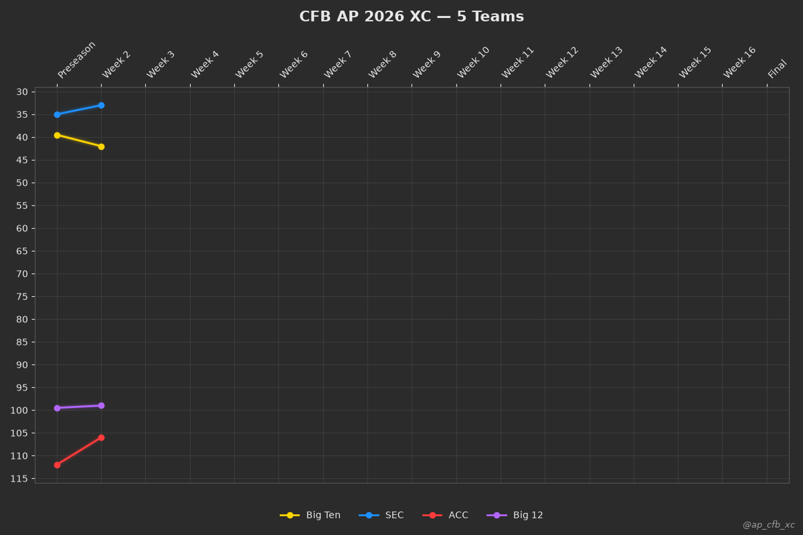
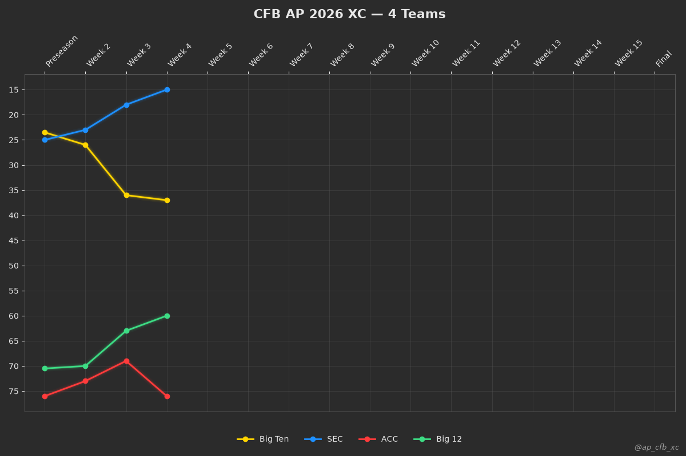
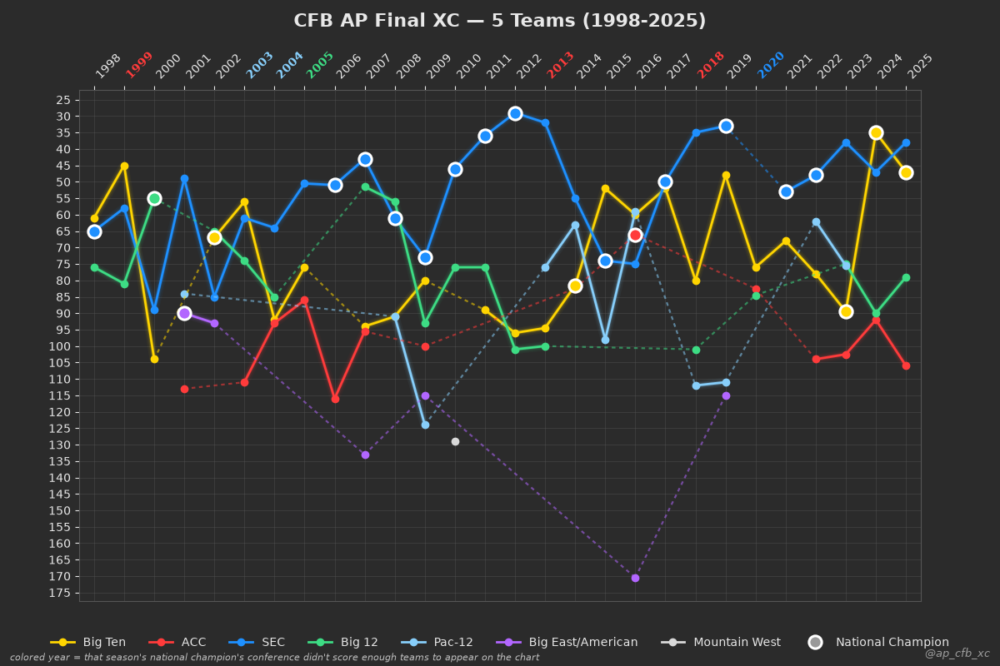

# AP College Football Cross-Country Scoring
***A Data-Driven Approach to Determining Conference Supremacy***

[//]: https://img.shields.io/badge/python-3.10%E2%80%933.13-E6BD29.svg


[](https://www.python.org/)
[](https://black.readthedocs.io/)

This repository implements a novel method for evaluating the best college football conferences
using a cross-country scoring mechanism.
This method ranks conferences based on the positions of their top teams in [the Associated Press's Top 25 rankings](https://apnews.com/hub/ap-top-25-college-football-poll)
before, throughout, and at the end of each college football season.
This provides an objective, measurable comparison of conference strength for every week of the season.

## Current Results
### 5-Team


<!-- XC-TABLE-5-TEAM:START -->
**2026 Week 3** — 5-team XC standings

| Pos | 1st · SEC | 2nd · Big Ten | 3rd · Big 12 | 4th · ACC |
|:---:|:---|:---|:---|:---|
| **Score** | **27** | **54** | **92** | **103** |
| 1 | Texas (1) | Indiana (4) | BYU (11) | Miami (5) |
| 2 | Georgia (2) | Ohio State (6) | Texas Tech (13) | SMU (16) |
| 3 | LSU (7) | USC (12) | Utah (17) | Louisville (23) |
| 4 | Ole Miss (8) | Penn State (14) | Houston (22) | Virginia (25) |
| 5 | Texas A&M (9) | Iowa (18) | Oklahoma St (29) | Virginia Tech (34) |
|  | ——— | ——— | ——— | ——— |
| 6 | *Alabama (10)* | *Michigan (19)* | *Arizona (37)* | *Pitt (39.5)* |
| 7 | *Tennessee (15)* | *Oregon (21)* | *Kansas St (39.5)* |  |
| 8 | *Missouri (20)* | *Washington (26)* |  |  |
| 9 | *Oklahoma (24)* | *UCLA (35)* |  |  |
| 10 | *Florida (27)* |  |  |  |
| 11 | *Mississippi St (32)* |  |  |  |
| 12 | *South Carolina (33)* |  |  |  |

<sub>Each team is shown with its AP ranking. A conference's score is the sum of its top five teams' rankings - lowest score wins, and ties are broken by each conference's 6th runner. Italicized teams don't count toward the score; DNS means the conference didn't have enough ranked teams to score.</sub>
<!-- XC-TABLE-5-TEAM:END -->

### 4-Team


## Background

Inspired by the team scoring in cross-country racing,
this method sums the "finishing positions," or the ranking, of the top five teams within each conference.
The conference with the lowest total score is deemed the best,
emphasizing overall depth and strength rather than just top-tier performance
(like whichever conference produced the most recent national champion, or bogus math like detailed in the below tweet).

<blockquote class="twitter-tweet" data-theme="dark"><p lang="en" dir="ltr">Take a look at the average AP Ranking by Power Five Conference 📊<br><br>Which conference surprises you the most? 👀 <a href="https://t.co/qJ0AWkQkOm">pic.twitter.com/qJ0AWkQkOm</a></p>&mdash; FOX College Football (@CFBONFOX) <a href="https://twitter.com/CFBONFOX/status/1615756033103626274?ref_src=twsrc%5Etfw">January 18, 2023</a></blockquote>

This approach was first introduced in 2015 and updated in 2019 and 2024. You can read more about the method and its evolution in the following blog posts:
- [2015: The Race for Supremacy](https://cooperconferencecolumn.wordpress.com/2015/08/25/the-race-for-supremacy-college-football-conferences-evaluated-by-a-cross-country-scoring-system/)
- [2019: AP XC - An Update](https://cooperconferencecolumn.wordpress.com/2019/08/19/ap-xc-an-update/)
- [2024: Updating the race for conference realignments | Medium](https://medium.com/@jacooper1317/the-race-for-college-football-conference-supremacy-a-cross-country-scoring-method-af662221bb88)

The results of this work across every season on record, tracking each conference's Final AP ranking score by year:


This code is built upon the ESPN College Football API, shown by [Akshay Easwaran](https://github.com/akeaswaran) to have
[hidden endpoints](https://gist.github.com/akeaswaran/b48b02f1c94f873c6655e7129910fc3b?permalink_comment_id=4376177)
with reliable AP ranking information back to 2014. Thus, this code is dependent upon the quality and stability of ESPN's API data structure.

The repo's weekly data reaches back further than that endpoint's dependable coverage: it now spans 1998 to the present,
with 1998-2011 imported from [collegepollarchive.com](https://collegepollarchive.com), 2012-2013 from
[Sports Reference](https://www.sports-reference.com/cfb/), and 2014 onward pulled from ESPN.

## Repository Structure

- [`data`](data): Input/output data, organized as `data/<year>/<4_team|5_team>/`. Each subdirectory holds
  one CSV per week (`<year>_week_<N>.csv`) plus one running `<year>_<4_team|5_team>_summary_statistics.csv`
  that accumulates every week's conference scores for that season.
- [`images`](images): Auto-generated graph PNGs referenced by this README. These are overwritten in place
  each time the graphing scripts run (see [Graphing](#graphing) below) - don't hand-edit them.
- [`espn_api.py`](espn_api.py): Script for fetching data from the ESPN API.
- [`store_data.py`](store_data.py): Script for storing data fetched from external sources.
- [`graph_data.py`](graph_data.py): Generates the styled graphs shown in this README, both for a single
  season and across every season on record (see "Graphing" under Specialized Uses below).
- [`readme_table.py`](readme_table.py): Rebuilds the 5-team standings table under the current-week graph
  above from the newest week stored in `data/` (the Markdown version of the console printout each weekly
  run produces). It only rewrites the text between the `XC-TABLE-5-TEAM` marker comments in this README.
- [`weekly_update.py`](weekly_update.py): One-shot entry point that pulls the latest rankings and
  regenerates the current-week graphs and standings table in a single call - see [Automating Weekly Updates](#automating-weekly-updates).
- [`counterfactual_conferences_2023.py`](counterfactual_conferences_2023.py): Standalone "what-if" script
  remapping 2023 results onto the 2024 realigned conferences.

## Python Environments
Make sure all [required packages](requirements.in) are installed. You can do this in a few ways:
### 1) Install to Base Interpreter 
Using your command line or bash terminal: 

```bash
pip install -r requirements.in
```

This will install the package's dependencies to your base python interpreter. 
This is not recommended as other python projects or repositories may require different versions of these packages.

`requirements.in` lists the packages this project actually needs, with any version pins kept deliberate
and minimal (e.g. a security-floor minimum version). [`requirements.txt`](requirements.txt), by contrast,
is a full `pip freeze` snapshot of a known-working environment - useful as a reference if you hit a
dependency conflict, but not what you should install from directly.

### 2) Virtual Environments
Setting up a virtual python environment (venv) is recommended to ensure no dependency conflicts 
across your personal projects or with other developers on this project.
See below for executing this on windows operating systems.

## Usage

To execute a full run that pulls the latest AP rankings from ESPN and scores them as a cross-country meet,
execute and run the [`store_data.py`](store_data.py) file.

## Automating Weekly Updates

[`weekly_update.py`](weekly_update.py) is a single entry point that does the whole week's work in one
call: it fetches and stores the latest AP rankings for both 4-team and 5-team scoring, then regenerates
`images/current_week_4team.png` and `images/current_week_5team.png` - the same filenames this README
links to above - and refreshes the 5-team standings table beneath the 5-team graph, so a new week's
results show up here automatically with no README edits needed.

Run it directly with your venv's interpreter:

```bash
python weekly_update.py
```

For unattended/scheduled runs, use the wrapper script for your OS instead of calling `weekly_update.py`
directly. Both scripts locate the project's `venv` relative to their own location - no machine-specific
paths to edit - and exit with a clear error if no venv is found rather than silently falling back to a
different interpreter:

- **Windows**: [`weekly_update.bat`](weekly_update.bat) - point a Task Scheduler (`schtasks`) job at this
  file.
- **Linux/macOS/WSL/Git Bash**: [`weekly_update.sh`](weekly_update.sh) - point a `cron` job at this file.
  It also works against a Windows-created venv when run from WSL or Git Bash.

Neither script pauses for input by default, so they're safe to run unattended; each has a commented-out
`pause` (Windows) / `read` (Linux) line you can uncomment if you'd rather the window stay open when
running it manually by double-click.

### Specialized Uses

1. **Fetch Data**:
   - Use [`espn_api.py`](espn_api.py) to fetch the latest college football data from ESPN.

   - **Critical Functions**:

     - **`full_ap_xc_run(year: int = None, week=None, four_team_score: bool = False) -> dict`**

       **Purpose**: Fetches the full AP cross-country run data for a given year and week, with an option for four-team scoring.

       **Inputs**:
       - `year`: The year for which to fetch data (optional).
       - `week`: The week for which to fetch data (optional).
       - `four_team_score`: Boolean indicating whether to use four-team scoring (default is `False`).

       **Outputs**:
       - A dictionary containing the fetched data, including conference team data and conference scores.

2. **Store Data**:
   - Use [`store_data.py`](store_data.py) to store the fetched data into a suitable format for analysis.

   - **Critical Functions**:

     - **`summarize_data(week, conference_score_tuple: list, n_teams_str: str = pent, existing_summary_df: pd.DataFrame = None)`**

       **Purpose**: Summarizes data for a given week and conference score tuple. It standardizes the week formatting, handles potential errors, and writes the summary data to a file.

       **Inputs**:
       - `week`: The week to summarize.
       - `conference_score_tuple`: List of conference scores.
       - `n_teams_str`: String indicating the number of teams (default is `pent`).
       - `existing_summary_df`: Existing summary DataFrame (optional).

       **Outputs**:
       - The summary data as a DataFrame.

     - **`store_weekly_results(year: int = None, week=None, four_team_score: bool = False)`**

       **Purpose**: Stores weekly results by calling various functions to fetch, prepare, and write data.

       **Inputs**:
       - `year`: The year to store results for (optional).
       - `week`: The week to store results for (optional).
       - `four_team_score`: Boolean indicating whether to use four-team scoring (default is `False`).

       **Outputs**:
       - The results of the storage operation.

     - **`store_all_data_2014_to_present()`**

       **Purpose**: Stores all data from 2014 to the present year by iterating through each year and week, calling `store_weekly_results` for both four-team and five-team scoring.

       **Inputs**: None

       **Outputs**: None

3. **Counterfactual Conference Analysis**:
   - Use [`counterfactual_conferences_2023.py`](counterfactual_conferences_2023.py) to impose the 2024 conference membership schema onto the 2023 season results, previewing how the realigned conferences could perform in 2024.

   - **Critical Functions**:

     - **`realign_teams(df: pd.DataFrame, n_teams_score: int = 5)`**

       **Purpose**: Realigns teams based on the 2024 conference membership schema and recalculates their standings using the 2023 season results. This function previews the future strength of each conference under the upcoming realignments.

       **Inputs**:
       - `df`: DataFrame containing the 2023 season results.
       - `n_teams_score`: The number of top team scores to sum for each conference (default is 5).

       **Outputs**:
       - A DataFrame with teams realigned to their new conferences and the recalculated conference standings.

4. **Graphing**:
   - Use [`graph_data.py`](graph_data.py) to turn a season's (or every season's) stored summary
     statistics into the styled, halogen-glow graphs shown at the top of this README.

   - **Critical Functions**:

     - **`graph_year(year: int, num_scoring_teams: int = 5, show: bool = True)`**

       **Purpose**: Plots one season's weekly conference scores, Preseason through Final.

       **Inputs**:
       - `year`: The season to graph.
       - `num_scoring_teams`: `4` or `5`; which scoring mode's data to plot (default `5`).
       - `show`: Whether to pop open a plot window (default `True`; set `False` for unattended runs).

       **Outputs**:
       - The `matplotlib.pyplot` module, with the generated figure as its current figure.

     - **`graph_final_rankings_by_year(num_scoring_teams: int = 5, show: bool = True)`**

       **Purpose**: Plots each conference's Final-week score across every season on record - one point
       per year - so you can see a conference's ranking trend over time rather than within one season.

       **Inputs**: Same as `graph_year`, minus `year` (it covers every season found under `data/`).

       **Outputs**:
       - The `matplotlib.pyplot` module, as above.

     - **`save_graph(plot, file_name: str = None) -> str`**

       **Purpose**: Saves a graph produced by the functions above to `images/`, creating that directory
       if needed. If `file_name` is omitted, it's derived from the graph's own title.

       **Inputs**:
       - `plot`: The return value of `graph_year()` / `graph_final_rankings_by_year()`.
       - `file_name`: Output filename (optional).

       **Outputs**:
       - The full path the image was saved to.

   - Conference line colors follow a fixed, deliberate convention (defined in `CONFERENCE_COLORS` in
     `graph_data.py`): SEC is blue, Big Ten is yellow, ACC is red, Big 12 is green, the Pac-12 is light
     blue (defunct as of 2024, but it still appears throughout the historical data), and the Mountain
     West is light silver. The Big East, the American (AAC), and the merged "Big East/American" line
     (see below) all share purple - reserved even though they rarely field enough ranked teams to
     score. Any other conference that shows up (CUSA, Sun Belt, MAC, etc.) is colored from
     `FALLBACK_COLORS` (pink, cyan, lime), since no fixed color has ever been established for them.

   - **Cross-season conference merges**: the all-time Final-rankings graph
     (`graph_final_rankings_by_year()`) treats renamed or realigned conferences as one continuous line
     (`CROSS_SEASON_CONFERENCE_MERGES` in `graph_data.py`). The Pac-10 is folded into the Pac-12, and
     the Big East and the American - Big East football became the American in 2013 - are folded together
     and labeled "Big East/American". Single-season graphs (`graph_year()`) aren't merged; they keep the
     conference names actually in use that year.

   - **National champions**: each season's national champion is the AP #1 team in that year's
     `*_week_final.csv`, looked up via its conference. That conference's point for the season is drawn
     larger with a white outline, with a "National Champion" legend entry (a single-season graph marks its
     Final week the same way once the Final poll is stored). If the champion's conference didn't score
     that season (DNS), there's no point to ring, so the year label on the x-axis is colored and bolded
     in that conference's color instead, with a footnote explaining the colored year.

   - **DNS gaps**: where a conference didn't score in some weeks or seasons, a thin dotted line in its
     color bridges the gap between its nearest scored points so the trend still reads. Bridges are only
     drawn across weeks or seasons that actually happened, never across not-yet-reached future weeks
     of an in-progress season.


## Contributing

Contributions are welcome!
Please fork the repository and create a pull request with your changes.

Thanks to [John-Lee-Cooper](https://github.com/John-Lee-Cooper), [seanreid5454](https://github.com/seanreid5454), &
[akeaswaran](https://github.com/akeaswaran) for their thought partnership and good ideas over the years on this project.

## License

This project is licensed under the GNU General Public License v3.0 - see the [LICENSE](LICENSE) file for details.
